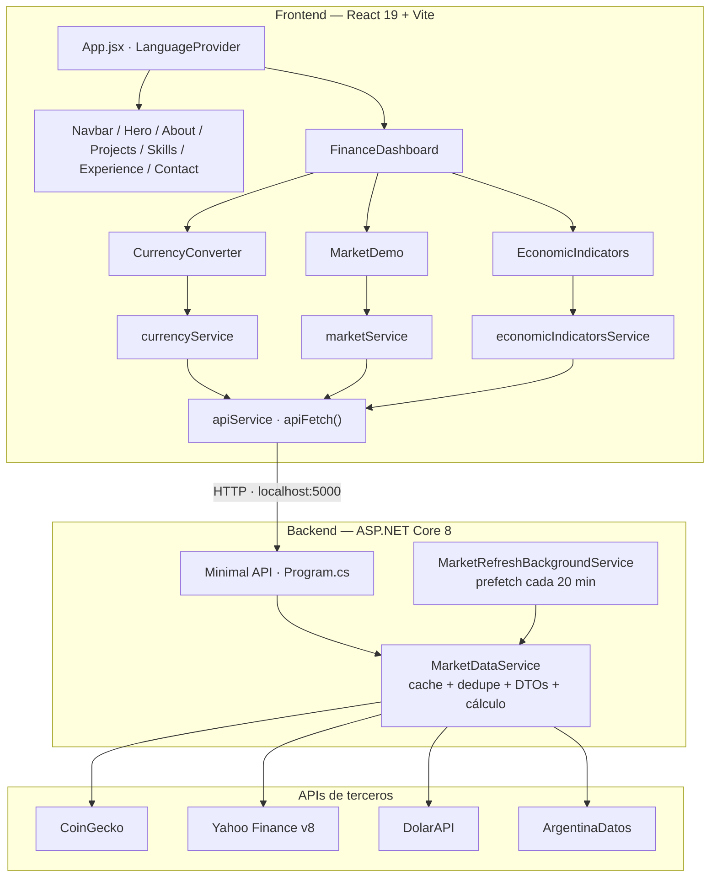
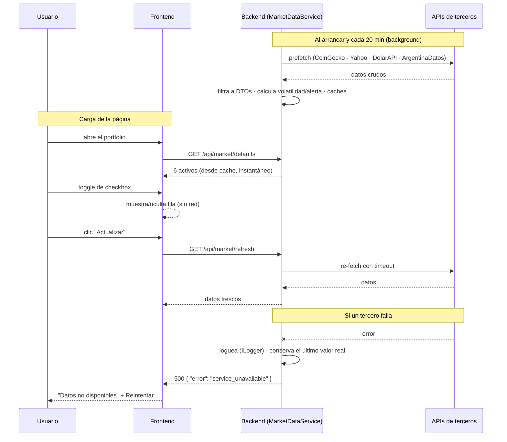

# Constanza Carnet — Portfolio

Portfolio personal desarrollado en **React 19 + Vite** con un **backend en ASP.NET Core 8**. Más que enumerar habilidades, las muestra en acción: incluye una *terminal financiera* funcional que integra datos de mercado en tiempo real (cripto, acciones, dólar e indicadores macro de Argentina), con una arquitectura pensada para que **el backend sea la única fuente de verdad** y para **no exponer nunca datos ni errores sensibles al cliente**.

---

## Stack tecnológico


---

## Secciones

- **Hero** — presentación con badge de disponibilidad y links de contacto
- **About** — perfil profesional y tecnologías principales
- **Finance Dashboard** — demo interactiva con datos en tiempo real (ver abajo)
- **Projects** — proyectos destacados con links a GitHub
- **Skills** — stack técnico por categoría y certificaciones
- **Experience** — trayectoria laboral en timeline
- **Contact** — canales de contacto directo

La app es una **SPA sin routing**: `App.jsx` renderiza todas las secciones en orden, envueltas en `LanguageProvider`. Toda la copia es **bilingüe (ES/EN)** y vive en `src/data/translations.js`.

---

## Arquitectura de componentes



El frontend **nunca** llama a una API de terceros ni inventa datos: cada servicio sólo hace `apiFetch` al backend y, si falla, el componente muestra un estado neutro de *"Datos no disponibles"* con botón de reintento. **No hay mocks, ni fallbacks estáticos de mercado, ni cache en el cliente** — el cache vive en el backend.

---

## Flujo de datos



---

## Finance Dashboard

Demo que integra cuatro fuentes externas, todas detrás del backend:

| Feature | Fuente |
|---|---|
| Cotizaciones cripto (BTC, ETH, SOL) | CoinGecko |
| Cotizaciones de acciones (AAPL, MSFT, GOOGL) | Yahoo Finance (endpoint v8 *chart*) |
| Tipos de cambio dólar (Oficial, MEP, Tarjeta, Cripto) | DolarAPI |
| Indicadores macro (riesgo país, inflación, UVA, plazo fijo) | ArgentinaDatos |

**Cómo funciona el cache:** al arrancar, el backend hace un *prefetch* de los activos por defecto (una llamada batched a CoinGecko + una llamada por símbolo a Yahoo en paralelo) y lo deja en su cache, que se refresca cada 20 minutos. El frontend carga esos activos **una sola vez** desde el cache caliente; togglear los checkboxes solo muestra/oculta filas (cero requests). El botón **"Actualizar"** fuerza un refresh del cache con timeout.

El backend **pre-calcula** todo lo que la tabla dibuja (precio, variación diaria, volatilidad y nivel de alerta), de modo que el cliente solo renderiza — no recibe JSON crudo de terceros.

---

## Seguridad

Decisiones clave para no filtrar información:

- **Errores nunca expuestos.** Si un tercero falla, el backend lo loguea con `ILogger` y responde un genérico `500 { "error": "service_unavailable" }`. Ningún mensaje de excepción ni stack trace llega al cliente. `UseExceptionHandler` actúa como red de seguridad global.
- **Respuestas filtradas.** Cada endpoint devuelve DTOs planos con *solo* los campos que la UI usa (ver `backend/Models/MarketModels.cs`); el JSON crudo de los proveedores no sale del servidor.
- **Sin llamadas a terceros desde el navegador.** Evita exponer endpoints/keys de proveedores y problemas de CORS. En el Network tab del browser solo se ven requests al backend propio.
- **Sin datos falseados.** No hay mocks ni valores aleatorios; ante una falla se conserva el último valor *real* cacheado o se muestra el estado vacío.
- **Rate limiting** por IP (60 req/min por defecto) y **CORS** restringido a orígenes configurados.

---

## Correr localmente

Requisitos: **Node 18+** y **.NET SDK 8**.

### Backend (fuente de datos)

```bash
cd backend
dotnet run        # http://localhost:5000
```

### Frontend

```bash
# en la raíz del proyecto
npm install

cp .env.example .env.local   # VITE_API_URL ya apunta a http://localhost:5000

npm run dev       # http://localhost:5173
```

Scripts disponibles: `npm run dev` · `npm run build` · `npm run preview` · `npm run lint`.

---

## Variables de entorno

`.env.local` en la raíz:

```
VITE_API_URL=http://localhost:5000   # backend ASP.NET Core (en prod, la URL de Render)
```

---

## Endpoints del backend

| Método · Ruta | Devuelve |
|---|---|
| `GET /api/portfolio/data` | Proyectos + experiencias (datos C# estáticos) |
| `GET /api/market/defaults` | Watchlist por defecto (cripto + acciones), pre-calculada y cacheada |
| `GET /api/market/refresh` | Fuerza refresh del cache y devuelve datos frescos |
| `GET /api/currency/dolar` | Cotizaciones del dólar (cacheadas) |
| `GET /api/indicators/economic` | Indicadores de Argentina (parseados/agregados + cache) |
| `GET /health` | Estado del servicio |

> Nota técnica: las acciones usan el endpoint **v8 `chart`** de Yahoo (`/v8/finance/chart/{symbol}`) y no el v7 *quote*, que hoy responde 401 sin un *crumb* de sesión.

---

## Deployment

- **Frontend** → Vercel. `vercel.json` configura el build de Vite (`outputDirectory: dist`) y sirve `/cv.pdf` inline como `application/pdf`.
- **Backend** → Render. La variable `VITE_API_URL` del frontend debe apuntar a esa URL. Las llamadas de finanzas usan un timeout amplio para tolerar el *cold start* del plan gratuito.

---

## Contacto

- LinkedIn: [constanza-desiree-carnet](https://www.linkedin.com/in/constanza-desiree-carnet/)
- GitHub: [@ConstanzaCarnet](https://github.com/ConstanzaCarnet)
